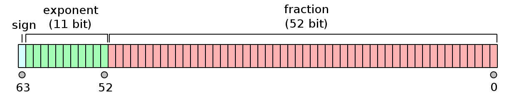

# Floating point arithmetic

## How floating point numbers are represented

The format of floating point numbers is set out in the [IEEE 754](https://en.wikipedia.org/wiki/IEEE_754) standard. Double-precision floating point numbers are represented using 64 bits (8 bytes). These are split into 1 bit for the sign of the number (0 for positive, 1 for negative), 11 bits for the exponent, and the remaining 52 bits are for the mantissa (also known as the significand).



([Image credit: Wikipedia](https://en.wikipedia.org/wiki/Double-precision_floating-point_format))

The corresponding floating point number is 

$$(-1)^s \times (1 + \sum_{i=1}^{52} b_{52-i} 2^{-i}) \times 2^{e-1023}$$

where $s$ is the value of the sign bit (0 or 1), $e$ is the value of the exponent, and $b_i$ corresponds to bit $i$ in the fraction, as labelled in the diagram.

The values of the exponents range from 
- $e=00000000001$ (binary) $=1$ (base 10), corresponding to $2^{e-1023}=2^{1-1023}=2^{-1022}$

to

- $e=11111111110=2046$, corresponding to $2^{e-1023}=2^{2046-1023}=2^{1023}$

(The values $e=0$ and $e=2047$ have special meaning -- see the [Wikipedia page on Double-precision floating-point format](https://en.wikipedia.org/wiki/Double-precision_floating-point_format) for more information.)


```{admonition} Questions
- What is the order of magnitude of the largest and smallest values that can be stored in a double?
- What is the binary representation of the number 3.0?
```

We focused here on double precision numbers, which are standard in 64 bit machines. Single precision floats are 32 bits, with 8 bits for exponent and 23 for mantissa.

**Further reading:** [What every computer scientist should know about floating-point arithmetic](https://dl.acm.org/doi/10.1145/103162.103163) by David Goldberg.

 
## Roundoff error

Roundoff error occurs because of the finite precision of floating point variables which means that many values cannot be represented exactly. You might think of irrational numbers (e.g. $\pi$) or recurring decimal such as $1/11=0.0909\dots$, but even $1/10=0.1$ doesn't have an exact representation in floating point where the fraction is written in base 2.

```{admonition} Exercise
Here are some floating point expressions to evaluate to illustrate roundoff:
- `(2**0.5)**2 - 2`
- `1.1 + 2.2 - 3.3`
- `0.1 == 0.10000001`
- `0.1 == 0.10000000000000001`
- `3 + 1e-15`
- `3 + 1e-16`
- `(0.7 + 0.1) + 0.3`
- `0.7 + (0.1 + 0.3)`
```

The size of the roundoff error is set by the number of bits that we have available for the fraction. For double precision, it is of order $2^{-52}\approx 2.2\times 10^{-16}$. Note that because we are talking about the fraction here, this number is the relative error rather than an absolute error. You might be thinking that this seems like a very small effect, since $2^{-52}$ is a small number! This is true, but you do have to be careful under certain situations:

- **Comparing floats.** Rather than comparing floats, it's better to instead test whether they are close to each other. E.g., with `x = 1.1 + 2.2`, `x==3.3` returns `False`, whereas `abs(x-3.3) < 1e-8`  returns `True`.

- **Subtracting numbers that are almost equal.** This comes up in many problems where you are evaluating a physical quantity which is given by subtracting two terms that almost cancel. If the difference between the two numbers becomes comparable to the floating point precision, roundoff error can dominate the answer. In these cases, you can often rewrite the expressions to be evaluated to avoid the subtraction, an example is given below.

- **When doing many operations and errors accumulate.** Small errors accumulate over many operations. An example is long term integrations of planetary orbits, for example when trying to compute the future evolution of the Solar System. Finite precision in chaotic systems can have a big impact on the solution.

```{admonition} Exercise

Consider the two forms of the function

$$f(x) = \sqrt{1+x^2}-x = {1\over \sqrt{1+x^2}+x}$$

One of these involves a subtraction, and one doesn't. Try evaluating and plotting these two expressions as a function of $x$. Which is more accurate? Do you see the effects of roundoff error at large values of $x$? How do you explain the size of $x$ where roundoff error appears?

```

**Further reading**

- Gezerlis, Chapter 2
- [Floating Point Arithmetic: Issues and Limitations](https://docs.python.org/3/tutorial/floatingpoint.html) from the Python documentation
- [Examples of floating point problems](https://jvns.ca/blog/2023/01/13/examples-of-floating-point-problems/)
- [The Perils of Floating Point](http://www.indowsway.com/floatingpoint.htm)


## NumPy data types

NumPy has many different data types, which you can read about here:
https://numpy.org/doc/stable/user/basics.types.html

The default type for a floating point is a 64 bit float as we discussed above.

```{admonition} Exercises

Here are some things to try to investigate NumPy data types:

- `np.finfo(np.float32).eps`
- `np.finfo(np.float64).eps`
- `a = np.ones(10); a.dtype`
- `np.double(2.2) + np.double(1.1) - np.double(3.3)`
- `np.single(2.2) + np.single(1.1) - np.single(3.3)`
- `np.int_(2) ** 10;   2**10`
- `np.int_(2) ** 100;   2**100`
- `np.spacing(3.0)`
```

The last example is one of several functions that NumPy has for dealing with floats --- see https://numpy.org/doc/stable/reference/routines.math.html

Note that numpy integers do not behave like Python integers! They have a fixed size in bytes (and therefore maximum and minimum values), whereas Python integers are objects that adapt their size to the precision needed.


