# Machine Learning

## Introduction

When it comes to machine learning we are dealing with a very broad and active field so it's often difficult to fully encompass all that falls under this umbrella. First off, it's important to discuss what we mean by certain terms. I often find that core concepts in [Machine Learning](https://en.wikipedia.org/wiki/Machine_learning) (ML) are familiar to folks, or easy to understand but people just have issues with the terminology. This is going to be a mix of the core concepts that cause ML to work as well as well as some introduction to the theory. This work relies heavily on [Mitchell](http://www.cs.cmu.edu/~tom/files/MachineLearningTomMitchell.pdf) (2017) as a key reference. We will try to summarise the state of the field and provide brief introduction to neural networks.

When discussing ML a lot of terms are used interchangeably, often because they are subsets of the larger. Here are a couple of key terms you may have heard used in the past along with the working definitions we will be using:

- **Artificial** **Intelligence** **(AI):** This broad category encompasses any task solved by a computer or robot that would normally require human intervention.
- **Machine Learning (ML):** These are a series of recursive techniques where a system improves its performance based on information applied to it.
- **Neural Networks (NN):** These are a specific flexible functional form capable of fitting a large set of functions. Often ML is optimising a neural network.
- **Deep Learning (DL):** These are a specific set of NN which have more "layers". This will be explained in a later section.

## State of the Field

A lot of machine learning is getting easier to perform. Performance statistics, not understanding, is the goal of most of these algorithms which means that many of the key techniques in machine learning do not have a good theoretical background. Often times the less “practical” guides just introduce some matrix algebra and less pictures, they are equally practical. Some techniques are still open questions so finding proofs for those are very challenging and aren't rigorously defined from first principles but instead arise from trial and error.

In many scenarios machine learning is more effective than traditional algorithms. In most cases, when you are only focused on performance then machine learning has a place.

As you may have seen now throughout the course, the vast majority of practical implementations of code that you use will come from preexisting packages. Even though you have learned [Levenberg–Marquardt](https://en.wikipedia.org/wiki/Levenberg%E2%80%93Marquardt_algorithm)  you are still more likely to use `scipy.curvefit` when you approach a problem. In machine learning this is often taken to the extreme where you will use many components that you may not fully understand every detail of but can still produce powerful results. Hopefully through this lecture you may be able to understand at least the broad scope of what the packages are doing and where to start to find resources to understand every component.

Unlike `scipy` and `numpy` there isn't a single accepted *framework* for machine learning. Instead there are multiple competing frameworks that can be used. Most of these are backed by large corporations but that means they are well supported and funded. Most ML work is done in these packages in both academia and outside. Once you learn the basics of one of these frameworks it's very easy to move and change your workflow to the others. Unfortunately, I will be teaching with [TensorFlow](https://www.tensorflow.org/). This framework is backed by Google, but is currently becoming less popular in academia. The following shows the popularity of frameworks with papers with Github repositories. [PyTorch](https://pytorch.org/) is becoming more popular as it is more *pythonic* and easier to debug.

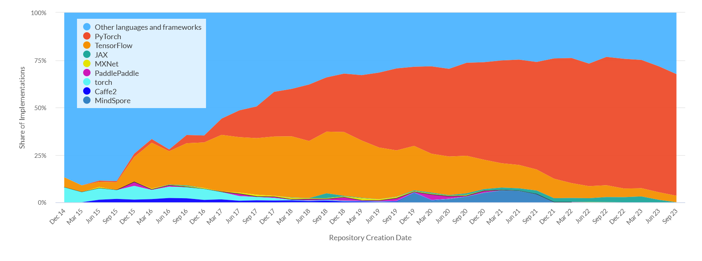

There are a couple of indicators though that `Tensorflow` may have a persistent userbase even if growth has slowed. There continues to be regular traffic in Google (as seen by [Google Trends](https://trends.google.com/trends/explore?date=all&q=tensorflow,pytorch&hl=en)) for `Tensorflow` although even there `PyTorch` appears to be overtaking the older framework.

## 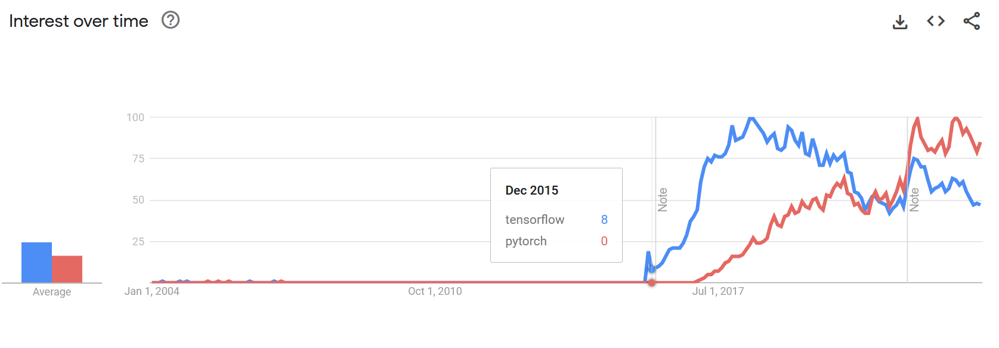

There has been a huge increase though in the last 10 years of the adoption and use of ML in a variety of applications mostly due to the development of these packages. The only other package that I will mention at this moment is *[Toolkit for Multivariate Data Analysis](https://root.cern/manual/tmva/) (TMVA)* in `ROOT`.  In many physics applications ROOT is still the dominant language as much of the legacy software was written in ROOT and so when applying ML to problems involving these datasets it's easier to remain in the `ROOT` framework.

## Unsupervised and Supervised Learning

In physics applications it's often useful to separate our problems into two scenarios based on the data that we have. These are *supervised learning* and *unsupervised learning*. We consider a supervised dataset as being one where for every data value we have a corresponding *label* or *true parameter* that we are seeking to often reproduce. We can represent this in simple set notation as:

Supervised Dataset $\{(x[i],d[i])\}_{i=1,2,3,....}$

Consider a *classification* problem, one where $d$ in this case could be some form of category. The other form of dataset would be an unsupervised dataset. With the same form this would look something like:

Unsupervised Dataset $\{(x[i],\_\_\}_{i=1,2,3,....}$

You can see that these datasets are clearly less helpful than the supervised training sets but often closer to what we might be able to collect in reality. We may not know the underlying characterisation of the data, we also may not have a complete picture of the data and so our classifications in $d$ might be incorrect.

A common physics application is **particle identification**, is this track a muon, an electron, or a dark matter particle? These will often also have unique shapes, impacts, and even sounds (see PICO). In the early days of particle physics (~1900s), one of the most useful particle detectors was the cloud chamber. These produce a trail of condensed gas along the path of ionisation caused by particle passing through the gas. The different masses and charges allowed for particle physicists to distinguish between different particles leading to many new discoveries. See below for a guide to the way that different particles behave in a cloud chamber:

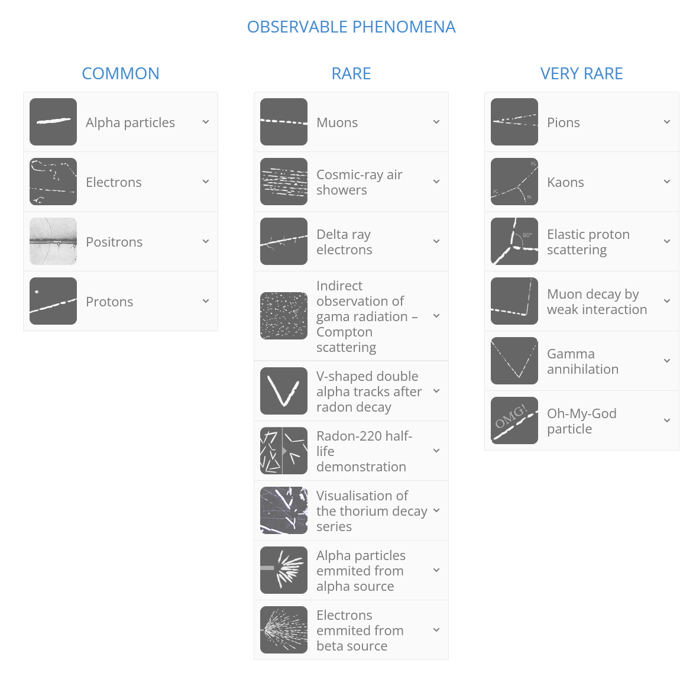

By default, a cloud chamber is an unsupervised environment. Passive cosmic rays impact the cloud chamber and don't label themselves after they've interacted. Although this is the case, you can convert unsupervised into an supervised dataset with a lot of work. If you were to try and create a supervised dataset for a cloud chamber there are multiple ways you could approach this problem.

- **Inject Known Signals**: Having radiation source for example could provide a large sample of beta or alpha particles which you could image and then create a set of data where the vast majority is a single particle type.
- **Simulate Images**: Take the known shapes, and either parameterise their forms or fully run through particle simulation in a software like GEANT4. This could artificially generate images that match the data and you would known exactly what type of particle was being produced by the simulation.
- **Manually Label**: The labelling of data could be done by hand. You could go through with your reference sheet some subset of images and generate the labelling manually or pseudo manually. This does require a lot of graduate student labor.

So overall it's often a very difficult process to generate an adequate training sample for supervised learning applications. In tutorials/online guides this process is often skipped and you are provided with a fully labelled dataset. Often in problems you will spend over 80% of your time generating the supervised training set

Now both of these scenarios often come up in physics. It's both often useful to attempt to extract "new information" from a large data set and also important to be able to extract known useful information reliably and quickly with an unknown function underneath. There are often a couple of sub fields that are discussed, when your $d$ only contains a set of target values, we often consider this a being a *classification* problem. In the continuous case this is called *regression*.

But all of these methods still require a deep understanding of your underlying sample in order to produce the labels. What if you have data with no labels? These *unsupervised* data sets can still be useful. If you are dealing with a set where you trying to sort the data into distinct categories then we call this *categorisation*. This is often useful when you know that your representation of the data aligns closely along its intrinsic properties. If it doesn't, often times the case when collecting raw data the things that are simple to measure may not be the intrinsic properties by which the system clusters, then you may want to try dimensionality reduction. Below is a map which illustrates how one may take the data set they have and begin to approach a machine learning problem in a `scikit-learn` framework.

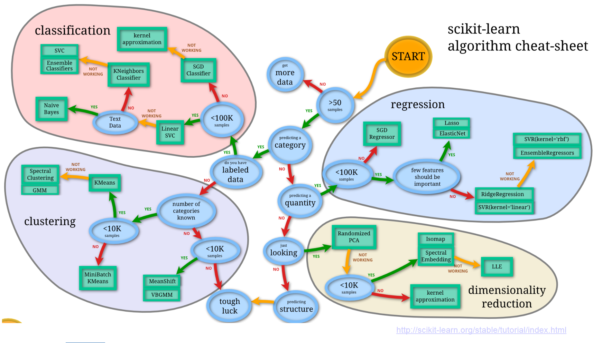

Let's look at an example based on the above mentioned particle classification in a bubble chamber trained by somebody else: https://www.youtube.com/watch?v=7ShRrDpjNQk . In this case the labelling was done manually.

In practice, this is used in VERITAS to separate gamma-rays and hadronic particles based on the images obtained after extensive air showers. Visually one can see a couple of clear features that are eventually picked up by the training. This work is based on a massive simulation effort to create a labelled training set that is optimized on. Current work is ongoing to improve our point spread function and sensitivity based on this work. There is also work being done by Maryn Askew (in this class) to asses improvements from using different frameworks. Supervised datsets have also been created for muon identification in VERITAS through manual labelling but by outsourcing the labour the labelling process to the public.

```{admonition} Example: Muon Hunter
 Visit [Muon Hunter](https://www.zooniverse.org/projects/zooniverse/muon-hunter-classic/) a "Zooniverse" project. Either select "Muon or Not?" or "Draw a Ring" and complete the tutorial. Classify a couple of examples. See how the data is being presented in way that makes the problem tractable for people with little knowledge of the problem. Check out [Zooniverse's](https://www.zooniverse.org/projects?discipline=physics&page=1&sort=-classifiers_count&status=live) other project and look through a couple of the other physics related projects. 
```

## ML Basics

So let's start from the beginning of a complicated problem and figure out how somebody would think about an issue in an ML framework. We will use the Mitchell definition of ML which is as follows:

`"A computer program is said to learn from experience E with respect to some class of tasks T and performance measure P, if its performance at tasks in T, as measured by P, improves with experience E.” (Mitchell, 1997)`

Starting with **tasks**, a task is what the computer is actually doing. This set of actions can be very simple or very arduous. Often times when using ML it’s easy to lose track of what you actually are trying to accomplish. You should clearly lay out your task for what you want from your tool to do at the beginning.

Some examples of common tasks include speech recognition, driving autonomous cars, astronomical classification, and playing backgammon. ML excels at some tasks but can often still perform pretty poorly in certain scenarios, the safest way to proceed is by seeing if this has been implemented in similar environments and expand slowly. There is other reasons to do this as well including the common practice of *bootstrapping* where you take preexisting networks trained on large datasets and insert them into your own training such that you do not need to start from scratch. It's becoming more of a regular practice in physics to make your code available after the publication of a paper which should continue to make this process easier in the future.

### Checkers

For our example of a task we will use the very simple **“playing a game of checkers”.** For those unfamiliar the rules of checkers they are very simple, you move pieces diagonally forward 1 square at a time unless the square is occupied by an opponents piece in which case (if there is empty space) you can capture the "piece" by jumping over it. You remove the captured the pieces. When you get to the last row you transform into a "king" which will allow the piece to also move backwards. The winner is decided when only pieces from one colour remain. 

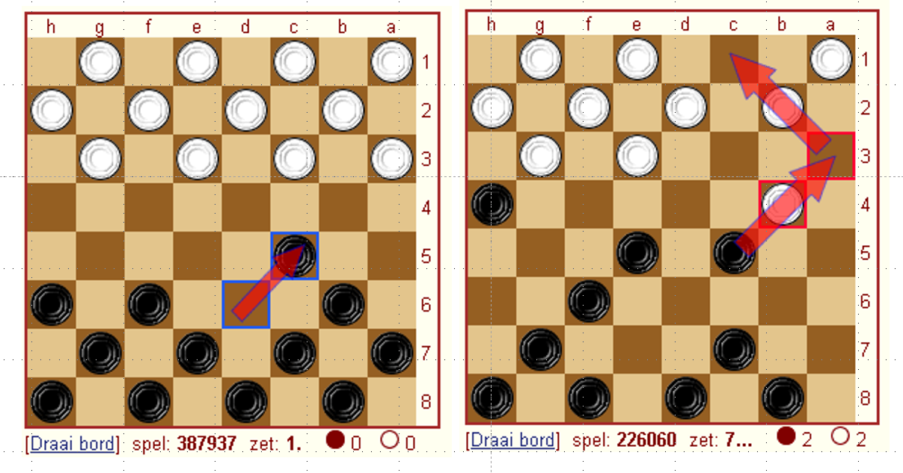

**Performance** measure is how you asses how well you are doing at the given task. This may seem easy but depending on how you formulate this, there can be a large discrepancies in your results. This measure of performance is often given many names depending on the precise discipline. This is often slightly different to what you use to actually train your data. For our example we would may not train our system by playing full games of checkers against an opponent but we would measure the success of our network based on those outcomes. The parameter than we use to improve our network is called the *loss function*. You will see later that you've already encountered something very similar to a *loss function*.

A well constructed *loss function* will be minimised as performance is maximised. Often times the performance is simply measured by the changes in this loss function.

**Experience** is how we explore the parameter space of our loss function. It’s how we get more information to asses how changes in task performance affect the loss function.

Gaining more experience in many environments is called *training*. Depending on your task this often involves millions of simulations. Real data is sometimes used but often for the requirements of ML you need to use large datasets. There is often a heavy computational or observational burden at this stage and it's often very unique to your particular problem. As such, resources for generating data sets to use in ML applications is often very sparse. For our checkers example we could use “games played against itself”.

This is the first of many choices that are made for this problem that carry with them some issues. In this case we run into a major issue of *generalisation error*. This arises when the data that we use for optimisation does not adequately represent the data that we are assessing the performance against. In this case the ability to perform well in games against an AI may not be the same as the ability to perform well against a human, which may be a metric that we are interested in measuring. If the AI only plays itself, there may be scenarios that are under weighted that a checkers champion may know by heart. Often generalisation error is only measured and there are earnest attempts to reduce the error at the early stages when the experience data set is being generated.

### Side note on Choices in Numerical Physics

Numerical methods is often filled with many choices with no particular right answer, simply the answer that seems best for your problem. In many classes prior, there will be a "right" way of coming to a solution. You are told to use the Lagrangian to answer this problem, or you are told to not use Gauss's law. In this class as well you will encounter well formulated problems that often take away from you the option to make choices. This assists greatly in assessing the ability of individual students however it does make it such that you will often not find yourself in the difficult position of making choices until you are well into your research or in industry. Depending on your supervisor you may not find yourself even making significant choices until you are more senior. The ability to select the right system to tackle a problem is just as important as the ability to implement that system well. I would encourage you in this class to recognise the tools put before you and make a note of when a choice is being made for you. Ask yourself why these choices are being made and do not take for granted that it's the best way to tackle a problem.

### Checkers Part 2

Let’s think more about this checkers problem and how we would go about designing a system. Specifically how we might chose to tackle the issue of of performance and loss functions. We know that we are simulating games of checkers, and we can tell if the system has lost or won based on the rules of the game but is this situation sufficient for training our system. Can we simply input a list of all board states in a game into the AI with a loss or a win and expect this system to be optimised? Well it depends but likely this will result in major problems.

Imagine the following scenario, what if during this simulated games the computer plays the best opening ever but loses due to some bad moves towards just the final half? To our system this would look the exact same as a game where every move was awful. This would result in a large amount of wasted information and also it will be more confusing for the system to understand when it is making good choices.

This is the problem of **credit assignment.** In cases where the feedback given is indirect (like in our example), how you determine what was the problem is hard. We could in principle asses instead individual checkers board states and do a move by move check, this would be more direct form feedback. But this also carries with it major issues as we will see.

Although our final performance metric is percent of games won, this not what we optimise. It is often best to reduce the problem of improving performance $P$ to task $T$ to the problem of learning some target function. In checkers a good target function is a choice of the best move from a set of legal moves. This could be shown as

$ChooseMove: B\rightarrow M$

It turns out though that $ChooseMove$ may seem like a good definition often times it’s better to define a function $V$ which instead tells us if a board state is “good” or “bad”.

Let’s call $V$ our target function, now we need to find a way to define a board state is good. Lets say that $V(b)$ is $V$ acting on some board state in $B$ the space containing all possible board states. One potential defintion could be the piecewise function:

- If $b$ is a won board state $V(b)=100$
- If $b$ is a lost board state $V(b)=-100$
- If $b$ is a drawn board state $V(b)=0$
- If $b$ is not a final state than $V(b)$ is the mean of all possible final board states that can be achieved from b

This is a *non operational* definition!

In practice this is impossible to compute, so we are looking for an *operational* target function. This is often only an approximation of $V$. So lets define $V^*$ as the operational approximation of $V$. This could be a lot of things including a neural network, but let’s start simple by using a linear combination of board features.

- *$x1$ : the number of black pieces on the board*
- *$x2$ : the number of red pieces on the board*
- *$x3$ : the number of black kings on the board*
- *$x4$ : the number of red kings on the board*
- *$x5$ : the number of black pieces threatened*
- *$x6$ : the number of red pieces threatened*


Having this target function we've now setup most of the problem. Below is a summary of this setup:
* * *
T: Play Checker
P: Percent of games won against opponents
E: Games played against itself

Target Function : $V : Board$
Target function approximation:
$V^*(b)= w0+w1x1+w2x2+w3x3+w4x4+w5x5+w6x6$
* * *
We have changed the problem from “learn checkers” which seems pretty daunting, to “learn 6 coefficients”. This simplification makes the problem much more tractable

$V^*$ is still hard to figure out though. We need some way of converting a win and a loss into some measurement of an individual board state without calculating all possible results.  What we want to give the code is some board state and an paired true V value such that you have $<b,V_{train}(b)>$.

An example would be
$<x1=3, x2=0, x3=1, x4=0, x5=0, x6=0,+100>$

The only information we have is all the moves played and whether the game was won or lost. To translate this into a measure of intermediate board states we can assign the training value to be approximately the value of the $V_{train}(b)\sim V^*(Successor(b))$ (the state after both players have moved subsequent to this one). This may seem a bit confusing but $V^*$ should begin to approach $V$ through minimization. There is a more rigorous proof of this under certain assumptions.

Now we can have a set of “measurements” or training examples $\{<b,V_{train}(b)>\}$ and we can adjust our weights till this is “good”. We would like to update our weights more rapidly based on how wrong the system is as well so we can define an error as being:

$E=\sum_{<b,V_{train}(b)>}(V_{train}(b)-V^*(b))^2$

These errors should be familiar to you know as should be the method of iteratively reducing. For each training example we will perform the following:
- Use the current weights to calculate $V^*(b)$
- For each weight update it by $η(Vtrain(b) – V*(b))$x where $η$ is a small constant.

And that's all that's required for finishing the setup of this machine learning problem. Coding this specific example would be quite a significant task but the framework for going through and setting up a machine learning problem should be clearer know. Mostly what you are trying to do is reduce a complicated problem into a situation where you are solving a linear equation again. This may not seem exceptionally satisfying but as you will see, having a flexible solver solve a flexible underlying function is all you need to solve some really difficul problem. Below is a flow chart that shows the decisions that were made as a part of this process. 

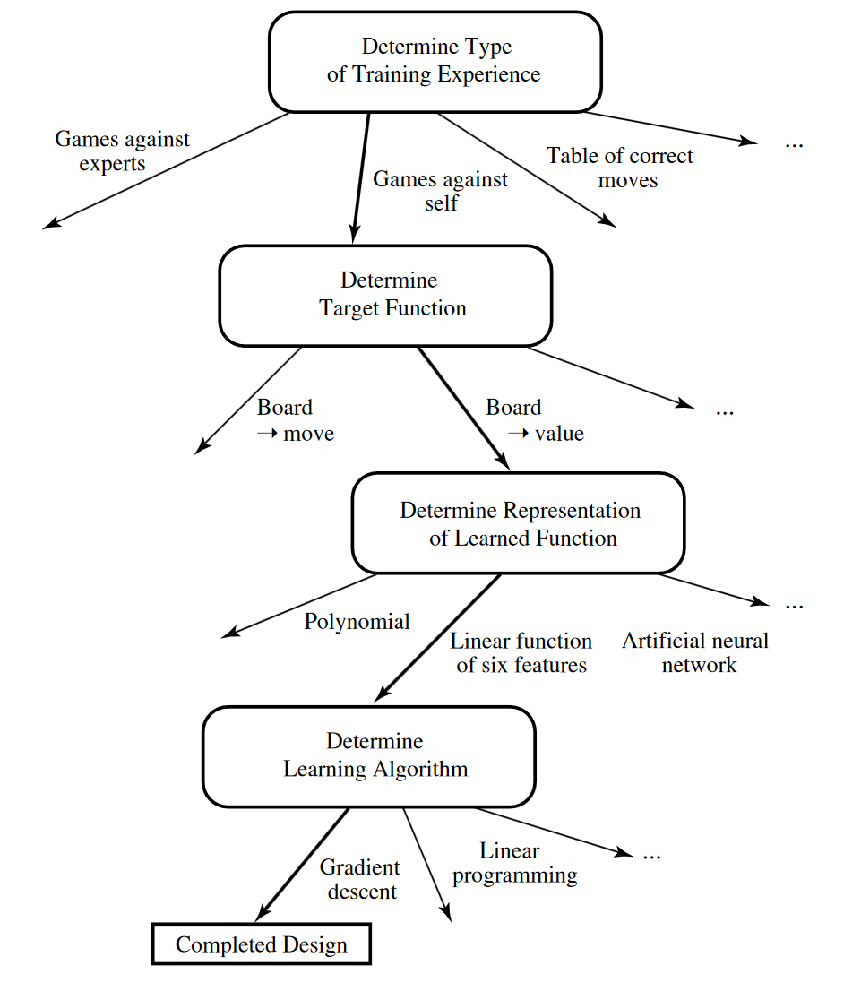


## Specific Examples

### Principle Component Analysis

PCA is the only form of unsupervised learning that will be discussed as it is often used in other forms of machine learning in order to understand the output. PCA is a form of dimensionality reduction where we seek to find the true principle axes of the underlying data and apply a transformation along the axes with the largest impact of the scatter of the data. PCA falls naturally out of SVD as PCA is simply the process of extracting the eigenvectors of the problem a reprojecting the variables onto those new axes. From the previous class we know any matrix there always exists a $U,S,V$ such that we can write

$X=USV^T$

with $U,V$ being orthongonal and $S$ being diagonal. Now the covariance of a matrix is given by $C=\frac{XX^T}{n-1}$. This is a square symmetric matrix where the variances lies on the diagonal and the covariances (measured of how often two datasets move in the same direction) lie of the off diagonal entries. Covariance matrices are extremely useful for understanding the relationship that different parts of you data have with other components. The eignevectors of this matrix are going to be the lines by which the data tends to vary. So substituting our SVD of $X$ into this defintion we have: 

$C=\frac{XX^T}{n-1}=\frac{VS^TU^TUSV^T}{n-1}=V\frac{S^2}{n-1}V^T$

Thus the $V$ that we obtain from the SVD of $X$ is a othronogonal matrix whose columns are the **eigenvector** of the covariance matrix, whose corresponding **eigenvalues** are in the diagonal of *S*.

```{admonition} Example: SVD to PCA

Write a code that randomly generates 100 two dimensional points following a linear function from 0 to 10 with slope 1. Add a Gaussian scatter to these points in y with sigma = 1. Center this data back to zero (the equations rely on this assumption). Add these all into a single vector and calculate single value decomposition. What is the form of V? Plot the two directions of the vectors in V, do these line up with your expectations? 
```
### Neural Networks
Neural networks, named after the neuron in the brain. These are functions created through dense sets of interconnected simple units that take an abitrary set of real inputs and translter them into a series of real value ouput. This is similar to the brain in the way we are run based on a series of small neuron activations. One of the fundamental units of the NN is the perceptron. These take the values from a series of real value input and pass the weighted sum of these quantieis into a function that return a value of -1 to 1. Perceptrons can easily construct boolean functions such that any abitrary function can be constructed out of these fundamentals. The process of developing complicated networks will simply involve construction complicated versions of these simple systems.  

From Mitchell (1997):
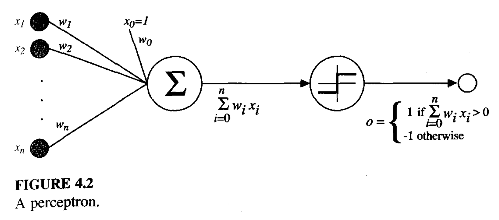

```{admonition} Example: Building a Perceptron

We build a neural network with a single node that takes three inputs and ouputs a single value. Define a sigmoidal function in python. Define as well the gradient of the sigmoidal function, we will see later in the course the importance of derviatives in optimization but for now it's simply a measure of the confidence of the existing weights. Initilize a weights vector with values between -1 and 1. 

Create a loop that performs the following n times:
Caclulate the dot product between the weights and the input. 
Pass the dot product to the sigmoidal function. 
Compare the output to the desired ouptut.
Update the weights by taking the dot product of the input and the error multiplied by the derivative of the sigmoid (add this).

Create a training set where if all the values in the input matrix are positive it's +1 and if any are negative it's 0. 

Run the network. 
```
### Specific Neural Networks

Here I will briefly touch on different common architectures that are discussed when people talk about ML applications. I will not describe them in detail just highlight when they are used and broadly how they work in principle. In order to understand them you first need to understand that every layer in a neural network doesn't need to be the same and also does not need to follow the simple outline above. Often these simple layers are called Dense layers, where every neuron is fully connected. One of the most common other layers is a convolutional layer where a dynamic filter is applied to the data often to smooth and down sample the data to key features. This is often used when information from the spatial realtionship of neighbouring entries is important (like an image). Pooling is a simple version of something similar where the average or maximum of a set of values is taken in a series of neighbouring pixels. 


The description of all the different layers is called the network architecture and often in papers people will explain the architecture they use to tackle their particular problem. An example [paper](https://www.nature.com/articles/s41524-022-00803-w)  by Yao et al. (2022) shows a style of presentation that is often used. Hopefully you can now broadly understand what's happening at a structural level when you see these plots and it's significantly less complicated than it looks. 

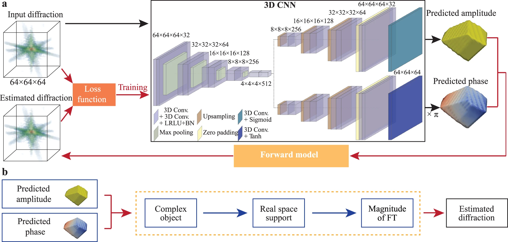

Other common forms of neural networks include recurrent neural networks. These break the unidirectional neural network and feed the input of some nodes to earlier layers. This gives the network a sort of internal memory that makes them very useful for applications where the sequence of the information contains necessary information to understand the subsequent steps. 

## Using AI Coding Assistance

Is it ethical to use AI coding assistance? What's the process for citing AI coding assistance? What's the process for citing code at all? These are all deeply interesting questions with no clear answers. The Canadian Institute for Theoretical Astrophysics (CITA) has had multiple talks with so called "GPT Pilots" who were just members with GPT 4 to describe how to integrate and use these tools as a part of your regular work flow. [A survey of developers was also conducted](https://arxiv.org/pdf/2303.17125.pdf). This allows us to learn some of the best uses for these tools as well as places where the tools currently tend to fail. 

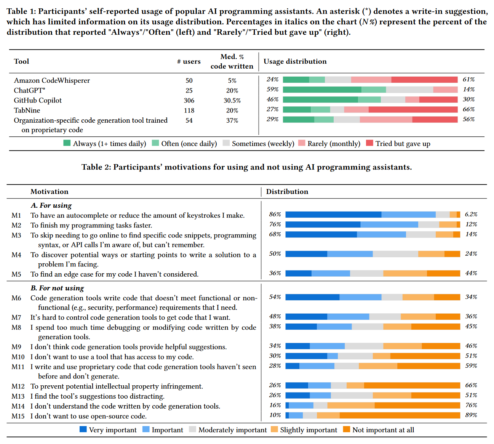

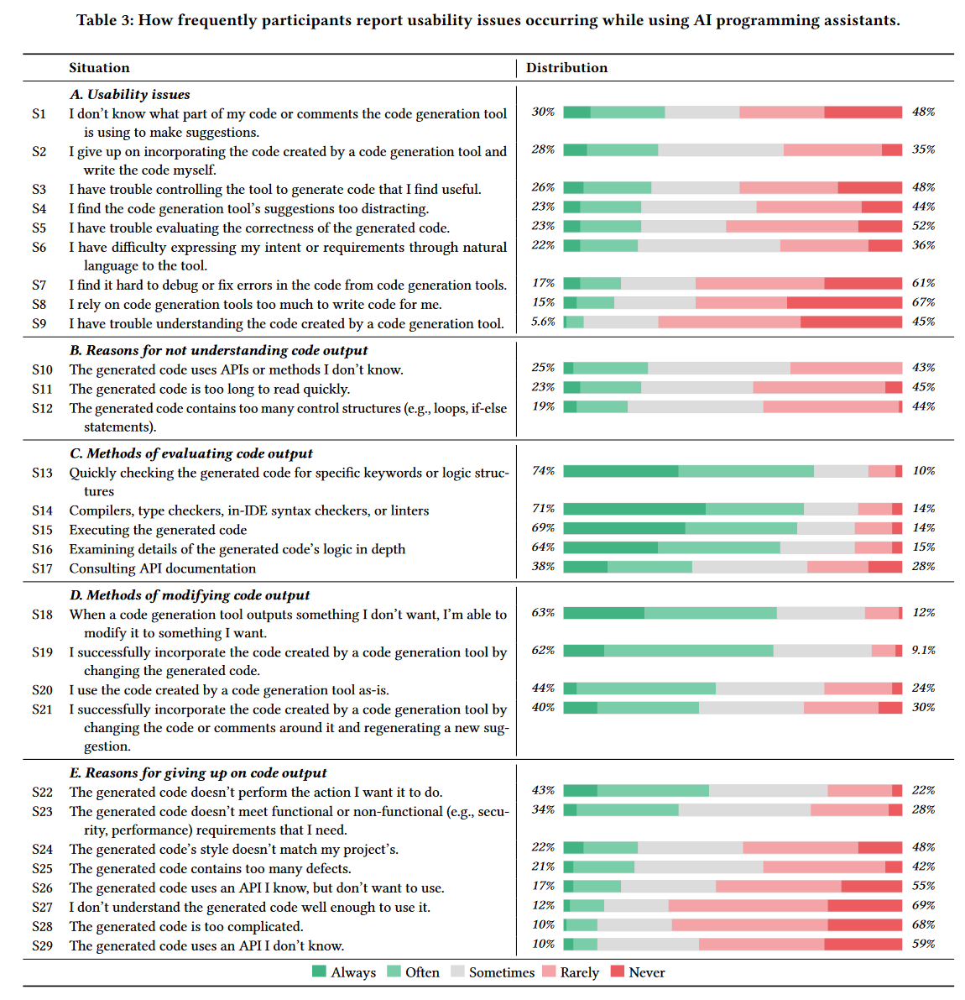

The two most popular tools are ChatGPT and GitHub Copilot both of which appear to have different and complementary applications to users workflow. ChatGPT is the most popular but users report a smaller fraction of their code being written by ChatGPT when compared to Copilot.

Often the tasks where users have a lot of success are currently repetitive or common tasks, things where you are typically using a well cited stackoverflow page or the example documentation. The most common reason though for giving up on code ouput (43% of the time) was that the output was not able to perform the task that was wanted.

There's also a couple of specific forms of advice that may be useful.
- Currently AI works well with "Complete code that is highly repetitive but cannot be copied and pasted directly"
- "It however, fails assisting me when I’m writing a more complex algorithm (if not well known)."
- "Since [the codebase] is a polyglot project with golang, java, and cpp implementations, I benefit a lot from...polyglot support."
- "I mainly use it to...annotate my code for my colleagues." 
-  "Be incredibly specific with the instructions and write them asprecisely as I would for a stupid collaborator."
-  "You have to break down what you’re trying to do and write it in steps, it can’t do too much at once.

### ChatGPT

ChatGPT is web based tool with a simple single line interface that can be found here: https://chat.openai.com/. At the time of writing the public free version is ChatGPT-3 althought GPT-4 is available to paid users. GPT-4 is going to be very exciting for physicists as there is a large implementation of plugins that allow you to do things that ChatGPT has been critized for not being able to do in the past. A Wolfram plugin makes solving equation far simpler and more reliable. The scholar plugin will allow it to pull from recent papers, you could ask it for a summary of recent results in a particular field and it will collect the papers that you want. This is a very easy and fun tool to explore. I find myself using ChatGPT in my work. You can see an example in the "Real Life Example" which was used to produce a trigger for [VERITAS](https://www.physics.mcgill.ca/~veritas/lmxb/) based on the summer research work of Justin Lipper. 

### Github Copilot

Github Copilot is integrated into the IDE enviroment and will provide suggestions based on the currently written code and comments. It is a paid feature to Github but you may be able to access it for free with your McGill email (https://github.com/features/copilot). I find myself using this less, it was a form of code autocomplete and code suggestions but it was often difficult to get it to produce large sections of code when I wanted to and I often found it insufficent for the application that I was trying to cover. 


```{admonition} Example: Is AI that good?
Try one of the previous exercises in ChatGPT, can you get it to reproduce the correct answer? Can you "prompt engineer" a solution? Did it take longer or shorter than you expect? What are some common errors?
```
# Further Reading

If you are interested in discussing how to incorporate machine learning into your work (and you are in the TSI) you can contact Ste O'Brien (who provided a lot of the following links).

## Books:

If you are the kind of physicist who love bra-ket notation, and finds Hamiltonians and statistical mechanics deeply satisfying then I recommend [Deep Learning and Physics](https://link.springer.com/book/10.1007/978-981-33-6108-9) by Akinori Tanaka et al. (2021).

[Machine Learning](http://www.cs.cmu.edu/~tom/files/MachineLearningTomMitchell.pdf) by Tom M. Mitchell (1997) is a simpler overview of the theoretical topics but provides little modern context or easy to implement examples.

## Introductory Links:

Google Intro ML Slides: [https://docs.google.com/presentation/d/1kSuQyW5DTnkVaZEjGYCkfOxvzCqGEFzWBy4e9Uedd9k/edit#slide=id.g183f28bdc3\_0\_82](https://docs.google.com/presentation/d/1kSuQyW5DTnkVaZEjGYCkfOxvzCqGEFzWBy4e9Uedd9k/edit#slide=id.g183f28bdc3_0_82)

NVIDIA Tutorial: [https://drive.google.com/file/d/11kCA4l9\_2ACQtdmQ7dp6Yl4\_eddeJYK3/view](https://drive.google.com/file/d/11kCA4l9_2ACQtdmQ7dp6Yl4_eddeJYK3/view)

CERN Tutorial:  [https://indico.cern.ch/event/1170064/attachments/2479920/4256927/vlimant\\\_CERN-SSL\\\_July22.pdf](https://indico.cern.ch/event/1170064/attachments/2479920/4256927/vlimant%5C_CERN-SSL%5C_July22.pdf)

## Specific Topics:

Random Forest Explainer : [https://mlu-explain.github.io/random-forest/?utm\_campaign=intro\_to\_data\_series&utm\_source=Data\_Elixir](https://mlu-explain.github.io/random-forest/?utm_campaign=intro_to_data_series&utm_source=Data_Elixir)

K Means Clustering:
[https://k-means-explorable.vercel.app/?utm\_campaign=intro\_to\_data\_series&utm\_source=Data\_Elixir](https://k-means-explorable.vercel.app/?utm_campaign=intro_to_data_series&utm_source=Data_Elixir)

Neural Networks from Scratch:
https://towardsdatascience.com/math-neural-network-from-scratch-in-python-d6da9f29ce65

LLM Explainer:
https://towardsdatascience.com/math-neural-network-from-scratch-in-python-d6da9f29ce65

Data Cleaning:
[https://counting.substack.com/p/data-cleaning-is-analysis-not-grunt?utm\_campaign=intro\_to\_data\_series&utm\_source=Data\_Elixir](https://counting.substack.com/p/data-cleaning-is-analysis-not-grunt?utm_campaign=intro_to_data_series&utm_source=Data_Elixir)

Lecture from CITA on ChatGPT
[https://www.youtube.com/watch?time\_continue=3496&v=Sgv0FKTEWK4&embeds\_referring\_euri=https%3A%2F%2Fwww.cita.utoronto.ca%2F&source\_ve\_path=Mjg2NjY&feature=emb\_logo](https://www.youtube.com/watch?time_continue=3496&v=Sgv0FKTEWK4&embeds_referring_euri=https%3A%2F%2Fwww.cita.utoronto.ca%2F&source_ve_path=Mjg2NjY&feature=emb_logo)

## Misc:

[https://handeaygenli.medium.com/particle-identification-system-in-cloud-chamber-using-yolov5-518d58ad9f8f\[\](https://www.youtube.com/watch?time\_continue=3496&v=Sgv0FKTEWK4&embeds\_referring\_euri=https%3A%2F%2Fwww.cita.utoronto.ca%2F&source\_ve\_path=Mjg2NjY&feature=emb\_logo)](https://handeaygenli.medium.com/particle-identification-system-in-cloud-chamber-using-yolov5-518d58ad9f8f%5B%5D%28https://www.youtube.com/watch?time_continue=3496&v=Sgv0FKTEWK4&embeds_referring_euri=https%3A%2F%2Fwww.cita.utoronto.ca%2F&source_ve_path=Mjg2NjY&feature=emb_logo%29 "https://handeaygenli.medium.com/particle-identification-system-in-cloud-chamber-using-yolov5-518d58ad9f8f%5B%5D(https://www.youtube.com/watch?time_continue=3496&v=Sgv0FKTEWK4&embeds_referring_euri=https%3A%2F%2Fwww.cita.utoronto.ca%2F&source_ve_path=Mjg2NjY&feature=emb_logo)")

McGill Cloud Chamber
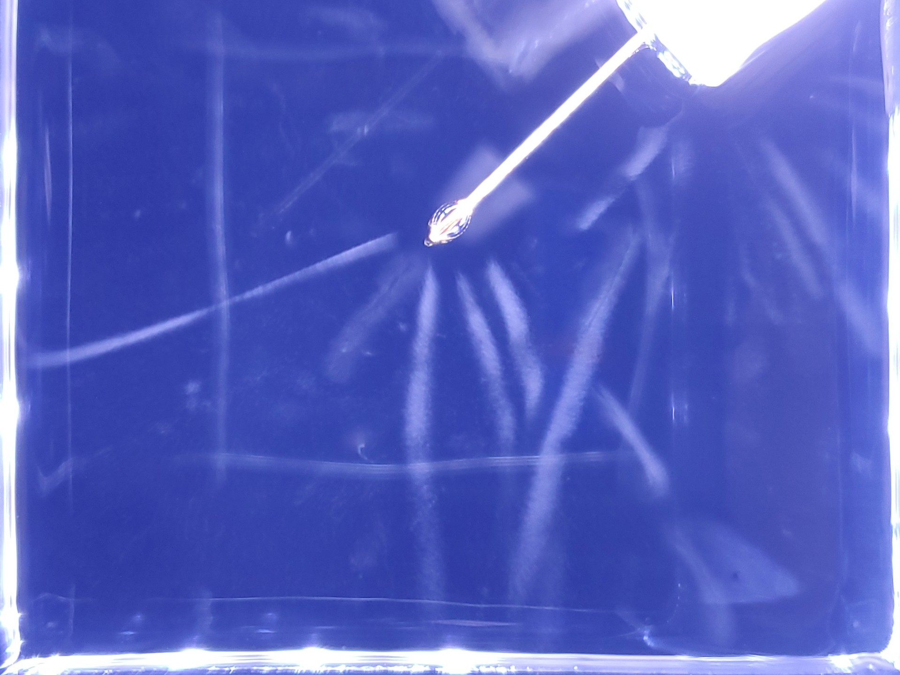
